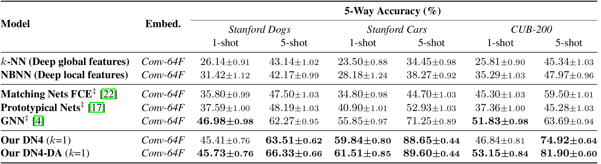

# DN4 in PyTorch

We provide a PyTorch implementation of DN4 for few-shot learning. If you use this code for your research, please cite: 

[Revisiting Local Descriptor based Image-to-Class Measure for Few-shot Learning](http://cs.nju.edu.cn/rl/people/liwb/CVPR19.pdf).<br> 
[Wenbin Li](https://cs.nju.edu.cn/liwenbin/), Lei Wang, Jinglin Xu, Jing Huo, Yang Gao and Jiebo Luo. In CVPR 2019.<br> 


## Prerequisites
- Linux
- Python 3
- Pytorch 0.4 or 1.0
- GPU + CUDA CuDNN
- pillow, torchvision, scipy, numpy

## Getting Started
### Installation

- Clone this repo:
```bash
git clone https://github.com/WenbinLee/DN4.git
cd DN4
```

- Install [PyTorch](http://pytorch.org) 1.0 and other dependencies.

### Datasets
- [miniImageNet](https://drive.google.com/file/d/1fUBrpv8iutYwdL4xE1rX_R9ef6tyncX9/view). 
- [StanfordDog](http://vision.stanford.edu/aditya86/ImageNetDogs/).
- [StanfordCar](https://ai.stanford.edu/~jkrause/cars/car_dataset.html).
- [CUB-200](http://www.vision.caltech.edu/visipedia/CUB-200.html). <br>
Thanks [Victor Garcia](https://github.com/vgsatorras/few-shot-gnn) for providing the miniImageNet dataset. In our paper, we just used the CUB-200 dataset. In fact, there is a newer revision of this dataset with more images, see [Caltech-UCSD Birds-200-2011](http://www.vision.caltech.edu/visipedia/CUB-200-2011.html). Note, if you use these datasets, please cite the corresponding papers. 


###  miniImageNet Few-shot Classification
- Train a 5-way 1-shot model based on Conv64F or ResNet256F:
```bash
python DN4_Train_5way1shot.py --dataset_dir ./datasets/miniImageNet --data_name miniImageNet
or
python DN4_Train_5way1shot_Resnet.py --dataset_dir ./datasets/miniImageNet --data_name miniImageNet
```
- Test the model (specify the dataset_dir, basemodel, and data_name first):
```bash
python DN4_Test_5way1shot.py --resume ./results/DN4_miniImageNet_Conv64F_5Way_1Shot_K3/model_best.pth.tar --basemodel Conv64F
or
python DN4_Test_5way1shot.py --resume ./results/DN4_miniImageNet_ResNet256F_5Way_1Shot_K3/model_best.pth.tar --basemodel ResNet256F
```

- The results on the miniImageNet dataset (If you set neighbor_k as 1, you may get better results in some cases): 


###  Fine-grained Few-shot Classification
- Data prepocessing (e.g., StanfordDog)
 - Specify the path of the dataset and the saving path.
 - Run the preprocessing script.
```bash
#!./dataset/StanfordDog_prepare_csv.py
python ./dataset/StanfordDog_prepare_csv.py
```
- Train a 5-way 1-shot model:
```bash
python DN4_Train_5way1shot.py --dataset_dir ./datasets/StanfordDog --data_name StanfordDog
```
- Test the model (specify the dataset_dir and data_name first):
```bash
python DN4_Test_5way1shot.py --resume ./results/DN4_StanfordDog_Conv64F_5_Way_1_Shot/model_best.pth.tar --basemodel Conv64F
```
- The results on the fine-grained datasets: 



## Citation
If you use this code for your research, please cite our paper.
```
@inproceedings{li2019DN4,
  title={Revisiting Local Descriptor based Image-to-Class Measure for Few-shot Learning},
  author={Li, Wenbin and Wang, Lei and Xu, Jinglin and Huo, Jing and Gao Yang and Luo, Jiebo},
  booktitle={CVPR},
  year={2019}
}
```
